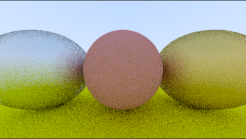

# Ray Tracing In p5.js

p5.js is a free, open-source JavaScript library for creative coding. It provides tools to make interactive visuals with code in a web browser.

Here I used this library to create a simple ray tracer. 

This project follows the tutorial [Ray Tracing in One Weekend](https://raytracing.github.io/books/RayTracingInOneWeekend.html) which is originally intended for C++ because of its speed.

## Features

The ray tracer features:
- Spheres
- Antialiasing
- Lambertian material
- Metal material

## Usage

To try this out, click [here](https://editor.p5js.org/Mudd/sketches/bfTSHU48-) to go to the p5.js editor. Press the run button and wait for the image to render.

Feel free to add, change, move the spheres in the world for different renders.

Change constants in the camera object in classes.js.

> _Note: Adding too many objects or increasing the constants in the camera object may crash the web page._  

---
Happy coding!
